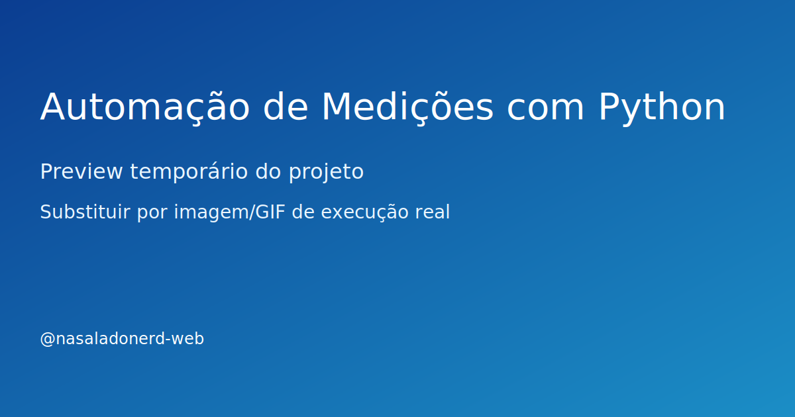

# Automação de Medições com Python

> 🚧 **Em construção:** este projeto está sendo desenvolvido aos poucos, com entregas incrementais.

## Problema

Automatizar boletins de medição de obras para reduzir retrabalho, erros de cálculo e tempo de fechamento.

## Solução

Pipeline em Python para ler planilhas de medição, validar regras contratuais e gerar saída padronizada para conferência.

## Stack

- Python, pandas, openpyxl, reportlab

## Resultado

- Estrutura inicial pronta para evolução incremental
- Base de código organizada para testes e documentação
- Repositório preparado para vitrine técnica no GitHub

## Demonstração



> Substitua depois por GIF real da execução (ex.: assets/demo.gif) assim que a primeira versão funcional estiver pronta.

## Status

Estudo aplicado

## Roadmap curto

- [ ] Implementar versão mínima funcional (MVP)
- [ ] Adicionar exemplo de entrada e saída
- [ ] Publicar GIF de execução no README
- [ ] Criar seção de lições aprendidas

## Como executar (placeholder)

```bash
# em breve
```

## Próxima entrega da semana

- [ ] Ler planilha de entrada com validação básica de colunas obrigatórias
- [ ] Gerar saída consolidada em formato Excel para conferência
- [ ] Documentar exemplo mínimo de uso no README
